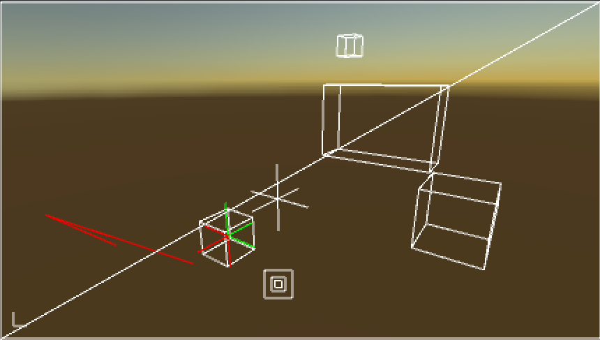
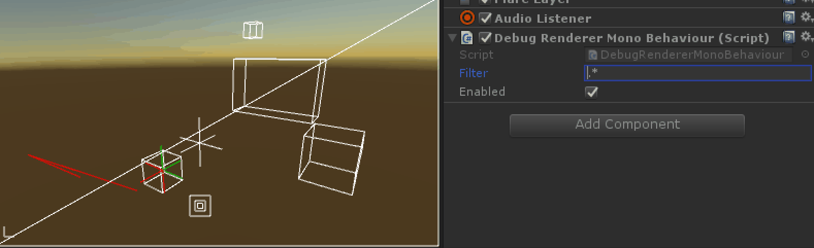

# Overview

During development, it's often handy to be able to render primitives to help visualize problems. Gizmos and Handles APIs are okay, but they have a number of shortcomings-- least of which is they do not render in the game view, which limits their usefulness for testing on device.

This debug rendering system has several goals:

* Nice interface.
* Option to compile out.
* Usable from anywhere, not just `OnPostRender`.
* 2D or 3D drawing.

#### Example

The included [Unity scene](Assets/Scenes/Test.unity) includes calls to all of the currently supported methods.



#### Setup

To use the debug renderer, simply attach the `DebugRendererMonoBehaviour` to your main camera. This component hosts the renderer and allows you to filter what is being rendered in realtime.



#### API

Usage revolves around two methods: `Handle` and `Handle2D`. These methods accept a category that is used to filter primitives. These methods return an `IFilteredRenderHandle` which may be `null`. The reason for this will be made clear presently.

```csharp
var handle = _renderer.Handle("My Specific Tag");
if (null != handle)
{
	//
}
```

The handle has a `Draw` method that accepts a callback for rendering. This callback is passed a renderer _context_, which has many methods for rendering primitives. The callback is queued and executed during the camera's `OnPostRender`, allowing you to queue dynamic renderer code at any time.

```csharp
var numThings = _myThings.Length;
var handle = _renderer.Handle("My Specific Tag");
if (null != handle)
{
  handle.Draw(ctx =>
  {
    ctx.Cube(Vector3.zero, 1);
    
    for (var i = 0; i < numThings; i++)
      ctx.Cube(
          _myThings[i].Position,
          _myThings[i].Size);
  });
}
```

**This is why the renderer can return a null handle**: methods with a `ConditionalAttribute` cannot accept closures. Thus, to avoid the overhead of lambda creation, when the renderer is disabled it returns null.

The `Handle` method is used for 3D primitives, while the `Handle2D` method is used for 2D primitives.

```csharp
var handle = _renderer.Handle2D("My Lines!");
if (null != handle)
{
  handle.Draw(ctx =>
    {
	    ctx.Line(Vector2.zero, new Vector2(Screen.width, Screen.height));
    });
}
```

These two methods pass different context objects to the callback.

#### Context

`RenderContext` is the object passed to the callback of the 3D `Handle` method.

**Color** - sets the color of following commands. The color will be reset once the callback is exited.

```csharp
ctx.Color(Color.red);
ctx.Cube(..);
```

**Line** - Draws a line from point to point.

```csharp
ctx.Line(Vector3.zero, transform.position);
```

**Lines** - Draws a list of lines. Requires an even number of points..

```csharp
ctx.Lines(
	Vector3.zero,
	new Vector3[]
	{
      a.Start,
      a.End,
      b.Start,
      b.End
	});
```

**LineStrip** - Draws a linestrip.

```csharp
ctx.Lines(
	Vector3.zero,
	new Vector3[]
	{
      _targets[0].Position,
      _targets[1].Position,
      _targets[2].Position
	});
```

**Cube** - Draws a cube.

```csharp
ctx.Cube(Vector3.zero, 10f);
```

**Prism** - Draws a bounds object.

```csharp
ctx.Prism(renderer.bounds);
```

**Plus** - Draws a plus sign along all axes.

```csharp
ctx.Plus(Vector3.zero, 4f);
```

#### RenderContext2D

**Square** - Draws a square.

```csharp
ctx.Line(Vector2.zero);
```

**Color** - sets the color of following commands. The color will be reset once the callback is exited.

```csharp
ctx.Color(Color.red);
ctx.Square(..);
```

**Line** - Draws a line from point to point.

```csharp
ctx.Line(Vector2.zero, new Vector2(Screen.width, Screen.height));
```

**Lines** - Draws a list of lines. Requires an even number of points..

```csharp
ctx.Lines(
	Vector2.zero,
	new Vector2[]
	{
      a.Start,
      a.End,
      b.Start,
      b.End
	});
```

**LineStrip** - Draws a linestrip.

```csharp
ctx.Lines(
	Vector2.zero,
	new Vector2[]
	{
      _targets[0].ScreenPosition,
      _targets[1].ScreenPosition,
      _targets[2].ScreenPosition
	});
```

**Square** - Draws a square.

```csharp
ctx.Square(
	Vector2.zero,
	2f);
```

**Rectangle** - Draws a rectangle.

```csharp
ctx.Rectangle(new Rect(0, 0, Screen.width, Screen.height));
```